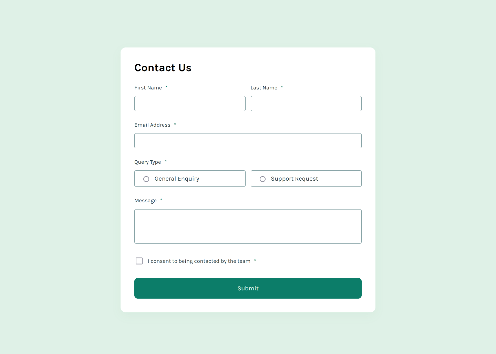

# Frontend Mentor - Contact form solution

This is a solution to the [Contact form challenge on Frontend Mentor](https://www.frontendmentor.io/challenges/contact-form--G-hYlqKJj). Frontend Mentor challenges help you improve your coding skills by building realistic projects. 

## Table of contents

- [Overview](#overview)
  - [The challenge](#the-challenge)
  - [Screenshot](#screenshot)
  - [Links](#links)
- [My process](#my-process)
  - [Built with](#built-with)
  - [What I learned](#what-i-learned)
  - [Continued development](#continued-development)
  - [Useful resources](#useful-resources)
- [Author](#author)
- [Acknowledgments](#acknowledgments)

**Note: Delete this note and update the table of contents based on what sections you keep.**

## Overview

### The challenge

Users should be able to:

- Complete the form and see a success toast message upon successful submission
- Receive form validation messages if:
  - A required field has been missed
  - The email address is not formatted correctly
- Complete the form only using their keyboard
- Have inputs, error messages, and the success message announced on their screen reader
- View the optimal layout for the interface depending on their device's screen size
- See hover and focus states for all interactive elements on the page

### Screenshot

### Links

- Solution URL: [Github](https://github.com/Absynthee/contact-form-main)
- Live Site URL: [Github Pages](https://absynthee.github.io/contact-form-main/)

## My process

### Built with

- Semantic HTML5 markup
- CSS custom properties
- CSS nesting
- Flexbox
- Javascript

### What I learned

This was pretty new to me as I haven't worked much with contact forms before. The styling wasn't too difficult but getting everything to process correctly was a pain. A lot of the javascript went over my head and I used copilot to aid in much of the JS.

I had to turn off the form sending as when it sent, the page refreshed and I wasn't able to show the success state. That's something I need to figure out in the future.

I used accent colours to style the radio and checkbox inputs instead of the provided SVGs (oops).

This was my first project where I leaned heavily into CSS nesting and I like it a lot, it feels like a natural way to do things.

### Continued development

I will definitely be returning to this project in the future when I have a better understanding of how forms work! The validation and everything that is handled in JS needs further work.

## Author

- Website - [Austin Spillman](https://www.austinspillman.com)
- Frontend Mentor - [@Absynthee](https://www.frontendmentor.io/profile/Absynthee)